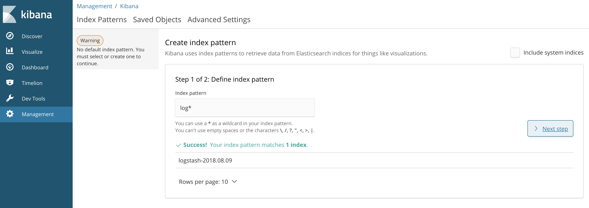
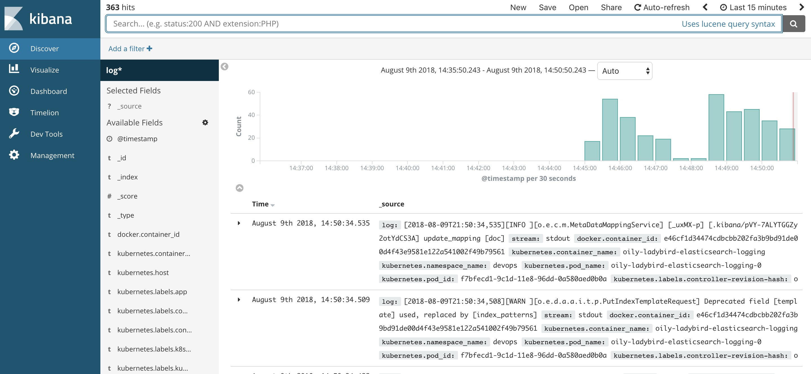

# Log Like You Mean It! Logging Kubernetes Applications via an EFK Stack

By Faiq Raza

## Overview 

Welcome to our EFK stack (Elastic Search, FluentD, Kibana) introduction series. This article will show you how to get up and running with EFK. 

The old problem of identifying and eliminating bugs in production has become more complicated in today’s cloud native world. Tracking application logs has been a widely-adopted industry standard for addressing this issue over the last few decades, but how does this approach mesh with the dynamic nature of containers and schedulers? Special measures need to be taken to preserve logs when something fails. Fortunately, we have tools available to do just that.

## Prerequisites 

An [Oracle Cloud Infrastructure](https://cloud.oracle.com/en_US/iaas) account with a running Oracle Container Engine for Kubernetes (OKE) cluster. 

## Enter Elasticsearch

Over the last few years Elasticsearch has become an industry standard for storing and indexing logs. Setting up and operating an Elasticsearch cluster can be a challenge for your team and paying for a hosted service can be expensive. If only there were an easy way to run Elasticsearch on existing infrastructure. Luckily this is easy to do with Kubernetes. To do so, we will leverage Kubernetes stateful sets, the Oracle Cloud Infrastructure (OCI) volume provisioner, and Helm to coordinate deployments to our cluster. 

Follow [the EFK quick start guide](http://www.oracle.com/webfolder/technetwork/tutorials/obe/oci/oke-full/index.html) for help creating a Kubernetes cluster with OKE and read this [article](quickstart.md) for getting Helm set up on your cluster.


The first step is to modify our Elasticsearch Helm chart template to fit your environment. 
We can do so by making our stateful set deployment complete with a volume claim that will be fulfilled by an OCI block volume. Here is the template that we will use: 


```yaml
apiVersion: apps/v1
kind: StatefulSet
metadata:
  name: {{ .Release.Name }}-elasticsearch-logging
  namespace: devops
  labels:
    k8s-app: {{ .Release.Name }}-elasticsearch-logging
    version: "{{ .Values.elasticsearch.version }}"
    kubernetes.io/cluster-service: "true"
    addonmanager.kubernetes.io/mode: Reconcile
spec:
  name: {{ .Release.Name }}-elasticsearch-logging
  replicas: {{ .Values.elasticsearch.replicacount }}
  selector:
    matchLabels:
      k8s-app: {{ .Release.Name }}-elasticsearch-logging
      version: "{{ .Values.elasticsearch.version }}"
  template:
    metadata:
      labels:
        k8s-app: {{ .Release.Name }}-elasticsearch-logging
        version: "{{ .Values.elasticsearch.version }}"
        kubernetes.io/cluster-service: "true"
    spec:
      serviceAccountName: {{ .Release.Name }}-elasticsearch-logging
      containers:
      - image: "docker.elastic.co/elasticsearch/elasticsearch-oss:{{ .Values.elasticsearch.version }}"
        name: {{ .Release.Name }}-elasticsearch-logging
        resources:
          # need more cpu upon initialization, therefore burstable class
          limits:
            cpu: 1000m
          requests:
            cpu: 100m
        ports:
        - containerPort: 9200
          name: db
          protocol: TCP
        - containerPort: 9300
          name: transport
          protocol: TCP
        volumeMounts:
        - name: elasticsearch-logging
          mountPath: /data
        env:
        - name: "NAMESPACE"
          valueFrom:
            fieldRef:
              fieldPath: metadata.namespace
  volumeClaimTemplates:
  - metadata:
      name: elasticsearch-logging
    spec:
      accessModes: [ "ReadWriteOnce" ]
      resources:
        requests:
          storage: 50Gi
      initContainers:
      - image: alpine:3.6
        command: ["/sbin/sysctl", "-w", "vm.max_map_count=262144"]
        name: elasticsearch-logging-init
        securityContext:
          privileged: true
```

## Log Capturing with FluentD 

Next we will set up FluentD, an open source log collector, which will grab the logs from our services and forward them to our Elasticsearch cluster. Kubernetes can schedule and run your containers on any nodes within the cluster. Therefore, it is important to run FluentD on all nodes. Thankfully Kubernetes has the concept of a DaemonSet, which will help us meet this requirement by ensuring all nodes will run a copy of the same pod.  


```
apiVersion: extensions/v1beta1
kind: DaemonSet
metadata:
  name: {{ .Release.Name }}-fluentd-es
  namespace: devops
  labels:
    k8s-app: fluentd-es
    version: "{{ .Values.fluentd.version }}"
    kubernetes.io/cluster-service: "true"
    addonmanager.kubernetes.io/mode: Reconcile
spec:
  selector:
    matchLabels:
      k8s-app: fluentd-es
      version: "{{ .Values.fluentd.version }}"
  template:
    metadata:
      labels:
        k8s-app: fluentd-es
        kubernetes.io/cluster-service: "true"
        version: "{{ .Values.fluentd.version }}"
      # This annotation ensures that Fluentd does not get evicted if the node
      # supports critical pod annotation based priority scheme.
      # Note that this does not guarantee admission on the nodes (#40573).
      annotations:
        scheduler.alpha.kubernetes.io/critical-pod: ""
        seccomp.security.alpha.kubernetes.io/pod: "docker/default"
    spec:
      priorityClassName: system-node-critical
      containers:
      - name: fluentd-es
        image: k8s.gcr.io/fluentd-elasticsearch:"{{ .Values.fluentd.version }}"
        env:
        - name: FLUENTD_ARGS
          value: --no-supervisor -q
        resources:
          limits:
            memory: 500Mi
          requests:
            cpu: 100m
            memory: 200Mi
        volumeMounts:
        - name: varlog
          mountPath: /var/log
        - name: varlibdockercontainers
          mountPath: /var/lib/docker/containers
          readOnly: true
        - name: config-volume
          mountPath: /etc/fluent/config.d
      terminationGracePeriodSeconds: 30
      volumes:
      - name: varlog
        hostPath:
          path: /var/log
      - name: varlibdockercontainers
        hostPath:
          path: /var/lib/docker/containers
      - name: config-volume
        configMap:
          name: {{ .Release.Name }}-fluentd-es-config
```

What this does:

*	Runs a FluentD pod on every node in our cluster
*	Attaches two host volumes to the pod in which container logs and metadata are written on the host node
*	Attaches a configuration map that configures our FluentD pods properly

That brings us to our next Helm chart: the ConfigMap.


```yaml
kind: ConfigMap
apiVersion: v1
metadata:
  name: {{ .Release.Name }}-fluentd-es-config
  namespace: devops
  labels:
    addonmanager.kubernetes.io/mode: Reconcile
data:
  system.conf: |-
    <system>
      root_dir /tmp/fluentd-buffers/
    </system>
  containers.input.conf: |-
    # This configuration file for Fluentd / td-agent is used
    # to watch changes to Docker log files. The kubelet creates symlinks that
    # capture the pod name, namespace, container name and Docker container ID
    # to the docker logs for pods in the /var/log/containers directory on the host.
    # If running this Fluentd configuration in a Docker container, the /var/log
    # directory should be mounted in the container.
    #
    # These logs are then submitted to Elasticsearch which assumes the
    # installation of the fluent-plugin-elasticsearch and the
    # fluent-plugin-kubernetes_metadata_filter plugins.
    # See https://github.com/uken/fluent-plugin-elasticsearch and
    # https://github.com/fabric8io/fluent-plugin-kubernetes_metadata_filter for
    # more information about the plugins.
    #
    # Example
    # =======
    # A line in the Docker log file might look like this JSON:
    #
    # {"log":"2014/09/25 21:15:03 Got request with path wombat\n",
    #  "stream":"stderr",
    #   "time":"2014-09-25T21:15:03.499185026Z"}
    #
    # The time_format specification below makes sure we properly
    # parse the time format produced by Docker. This will be
    # submitted to Elasticsearch and should appear like:
    # $ curl 'http://elasticsearch-logging:9200/_search?pretty'
    # ...
    # {
    #      "_index" : "logstash-2014.09.25",
    #      "_type" : "fluentd",
    #      "_id" : "VBrbor2QTuGpsQyTCdfzqA",
    #      "_score" : 1.0,
    #      "_source":{"log":"2014/09/25 22:45:50 Got request with path wombat\n",
    #                 "stream":"stderr","tag":"docker.container.all",
    #                 "@timestamp":"2014-09-25T22:45:50+00:00"}
    #    },
    # ...
    #
    # The Kubernetes Fluentd plugin is used to write the Kubernetes metadata to the log
    # record and add labels to the log record if properly configured. This enables users
    # to filter and search logs on any metadata.
    # For example, a Docker container's logs might be in the directory:
    #
    #  /var/lib/docker/containers/997599971ee6366d4a5920d25b79286ad45ff37a74494f262e3bc98d909d0a7b
    #
    # and in the file:
    #
    #  997599971ee6366d4a5920d25b79286ad45ff37a74494f262e3bc98d909d0a7b-json.log
    #beta1
    # where 997599971ee6... is the Docker ID of the running container.
    # The Kubernetes kubelet makes a symbolic link to this file on the host machine
    # in the /var/log/containers directory which includes the pod name and the Kubernetes
    # container name:
    #
    #    synthetic-logger-0.25lps-pod_default_synth-lgr-997599971ee6366d4a5920d25b79286ad45ff37a74494f262e3bc98d909d0a7b.log
    #    ->
    #    /var/lib/docker/containers/997599971ee6366d4a5920d25b79286ad45ff37a74494f262e3bc98d909d0a7b/997599971ee6366d4a5920d25b79286ad45ff37a74494f262e3bc98d909d0a7b-json.log
    #
    # The /var/log directory on the host is mapped to the /var/log directory in the container
    # running this instance of Fluentd and we end up collecting the file:
    #
    #   /var/log/containers/synthetic-logger-0.25lps-pod_default_synth-lgr-997599971ee6366d4a5920d25b79286ad45ff37a74494f262e3bc98d909d0a7b.log
    #
    # This results in the tag:
    #
    #  var.log.containers.synthetic-logger-0.25lps-pod_default_synth-lgr-997599971ee6366d4a5920d25b79286ad45ff37a74494f262e3bc98d909d0a7b.log
    #
    # The Kubernetes Fluentd plugin is used to extract the namespace, pod name and container name
    # which are added to the log message as a Kubernetes field object and the Docker container ID
    # is also added under the Docker field object.
    # The final tag is:
    #
    #   kubernetes.var.log.containers.synthetic-logger-0.25lps-pod_default_synth-lgr-997599971ee6366d4a5920d25b79286ad45ff37a74494f262e3bc98d909d0a7b.log
    #
    # And the final log record looks like this:
    #
    # {
    #   "log":"2014/09/25 21:15:03 Got request with path wombat\n",
    #   "stream":"stderr",
    #   "time":"2014-09-25T21:15:03.499185026Z",
    #   "kubernetes": {
    #     "namespace": "default",
    #     "pod_name": "synthetic-logger-0.25lps-pod",
    #     "container_name": "synth-lgr"
    #   },
    #   "docker": {
    #     "container_id": "997599971ee6366d4a5920d25b79286ad45ff37a74494f262e3bc98d909d0a7b"
    #   }
    # }
    #
    # This makes it easier for users to search for logs by pod name or by
    # the name of the Kubernetes container regardless of how many times the
    # Kubernetes pod has been restarted (resulting in several Docker container IDs).
    # JSON Log Example:
    # {"log":"[info:2016-02-16T16:04:05.930-08:00] Some log text here\n","stream":"stdout","time":"2016-02-17T00:04:05.931087621Z"}
    # CRI Log Example:
    # 2016-02-17T00:04:05.931087621Z stdout F [info:2016-02-16T16:04:05.930-08:00] Some log text here
    <source>
      @id fluentd-containers.log
      @type tail
      path /var/log/containers/*.log
      pos_file /var/log/es-containers.log.pos
      time_format %Y-%m-%dT%H:%M:%S.%NZ
      tag raw.kubernetes.*
      read_from_head true
      <parse>
        @type multi_format
        <pattern>
          format json
          time_key time
          time_format %Y-%m-%dT%H:%M:%S.%NZ
        </pattern>
        <pattern>
          format /^(?<time>.+) (?<stream>stdout|stderr) [^ ]* (?<log>.*)$/
          time_format %Y-%m-%dT%H:%M:%S.%N%:z
        </pattern>
      </parse>
    </source>
    # Detect exceptions in the log output and forward them as one log entry.
    <match raw.kubernetes.**>
      @id raw.kubernetes
      @type detect_exceptions
      remove_tag_prefix raw
      message log
      stream stream
      multiline_flush_interval 5
      max_bytes 500000
      max_lines 1000
    </match>
  system.input.conf: |-
    # Example:
    # 2015-12-21 23:17:22,066 [salt.state       ][INFO    ] Completed state [net.ipv4.ip_forward] at time 23:17:22.066081
    <source>
      @id minion
      @type tail
      format /^(?<time>[^ ]* [^ ,]*)[^\[]*\[[^\]]*\]\[(?<severity>[^ \]]*) *\] (?<message>.*)$/
      time_format %Y-%m-%d %H:%M:%S
      path /var/log/salt/minion
      pos_file /var/log/salt.pos
      tag salt
    </source>
    # Example:
    # Dec 21 23:17:22 gke-foo-1-1-4b5cbd14-node-4eoj startupscript: Finished running startup script /var/run/google.startup.script
    <source>
      @id startupscript.log
      @type tail
      format syslog
      path /var/log/startupscript.log
      pos_file /var/log/es-startupscript.log.pos
      tag startupscript
    </source>
    # Examples:
    # time="2016-02-04T06:51:03.053580605Z" level=info msg="GET /containers/json"
    # time="2016-02-04T07:53:57.505612354Z" level=error msg="HTTP Error" err="No such image: -f" statusCode=404
    # TODO(random-liu): Remove this after cri container runtime rolls out.
    <source>
      @id docker.log
      @type tail
      format /^time="(?<time>[^)]*)" level=(?<severity>[^ ]*) msg="(?<message>[^"]*)"( err="(?<error>[^"]*)")?( statusCode=($<status_code>\d+))?/
      path /var/log/docker.log
      pos_file /var/log/es-docker.log.pos
      tag docker
    </source>
    # Example:
    # 2016/02/04 06:52:38 filePurge: successfully removed file /var/etcd/data/member/wal/00000000000006d0-00000000010a23d1.wal
    <source>
      @id etcd.log
      @type tail
      # Not parsing this, because it doesn't have anything particularly useful to
      # parse out of it (like severities).
      format none
      path /var/log/etcd.log
      pos_file /var/log/es-etcd.log.pos
      tag etcd
    </source>
    # Multi-line parsing is required for all the kube logs because very large log
    # statements, such as those that include entire object bodies, get split into
    # multiple lines by glog.
    # Example:
    # I0204 07:32:30.020537    3368 server.go:1048] POST /stats/container/: (13.972191ms) 200 [[Go-http-client/1.1] 10.244.1.3:40537]
    <source>
      @id kubelet.log
      @type tail
      format multiline
      multiline_flush_interval 5s
      format_firstline /^\w\d{4}/
      format1 /^(?<severity>\w)(?<time>\d{4} [^\s]*)\s+(?<pid>\d+)\s+(?<source>[^ \]]+)\] (?<message>.*)/
      time_format %m%d %H:%M:%S.%N
      path /var/log/kubelet.log
      pos_file /var/log/es-kubelet.log.pos
      tag kubelet
    </source>
    # Example:
    # I1118 21:26:53.975789       6 proxier.go:1096] Port "nodePort for kube-system/default-http-backend:http" (:31429/tcp) was open before and is still needed
    <source>
      @id kube-proxy.log
      @type tail
      format multiline
      multiline_flush_interval 5s
      format_firstline /^\w\d{4}/
      format1 /^(?<severity>\w)(?<time>\d{4} [^\s]*)\s+(?<pid>\d+)\s+(?<source>[^ \]]+)\] (?<message>.*)/
      time_format %m%d %H:%M:%S.%N
      path /var/log/kube-proxy.log
      pos_file /var/log/es-kube-proxy.log.pos
      tag kube-proxy
    </source>
    # Example:
    # I0204 07:00:19.604280       5 handlers.go:131] GET /api/v1/nodes: (1.624207ms) 200 [[kube-controller-manager/v1.1.3 (linux/amd64) kubernetes/6a81b50] 127.0.0.1:38266]
    <source>
      @id kube-apiserver.log
      @type tail
      format multiline
      multiline_flush_interval 5s
      format_firstline /^\w\d{4}/
      format1 /^(?<severity>\w)(?<time>\d{4} [^\s]*)\s+(?<pid>\d+)\s+(?<source>[^ \]]+)\] (?<message>.*)/
      time_format %m%d %H:%M:%S.%N
      path /var/log/kube-apiserver.log
      pos_file /var/log/es-kube-apiserver.log.pos
      tag kube-apiserver
    </source>
    # Example:
    # I0204 06:55:31.872680       5 servicecontroller.go:277] LB already exists and doesn't need update for service kube-system/kube-ui
    <source>
      @id kube-controller-manager.log
      @type tail
      format multiline
      multiline_flush_interval 5s
      format_firstline /^\w\d{4}/
      format1 /^(?<severity>\w)(?<time>\d{4} [^\s]*)\s+(?<pid>\d+)\s+(?<source>[^ \]]+)\] (?<message>.*)/
      time_format %m%d %H:%M:%S.%N
      path /var/log/kube-controller-manager.log
      pos_file /var/log/es-kube-controller-manager.log.pos
      tag kube-controller-manager
    </source>
    # Example:
    # W0204 06:49:18.239674       7 reflector.go:245] pkg/scheduler/factory/factory.go:193: watch of *api.Service ended with: 401: The event in requested index is outdated and cleared (the requested history has been cleared [2578313/2577886]) [2579312]
    <source>
      @id kube-scheduler.log
      @type tail
      format multiline
      multiline_flush_interval 5s
      format_firstline /^\w\d{4}/
      format1 /^(?<severity>\w)(?<time>\d{4} [^\s]*)\s+(?<pid>\d+)\s+(?<source>[^ \]]+)\] (?<message>.*)/
      time_format %m%d %H:%M:%S.%N
      path /var/log/kube-scheduler.log
      pos_file /var/log/es-kube-scheduler.log.pos
      tag kube-scheduler
    </source>
    # Example:
    # I1104 10:36:20.242766       5 rescheduler.go:73] Running Rescheduler
    <source>
      @id rescheduler.log
      @type tail
      format multiline
      multiline_flush_interval 5s
      format_firstline /^\w\d{4}/
      format1 /^(?<severity>\w)(?<time>\d{4} [^\s]*)\s+(?<pid>\d+)\s+(?<source>[^ \]]+)\] (?<message>.*)/
      time_format %m%d %H:%M:%S.%N
      path /var/log/rescheduler.log
      pos_file /var/log/es-rescheduler.log.pos
      tag rescheduler
    </source>
    # Example:
    # I0603 15:31:05.793605       6 cluster_manager.go:230] Reading config from path /etc/gce.conf
    <source>
      @id glbc.log
      @type tail
      format multiline
      multiline_flush_interval 5s
      format_firstline /^\w\d{4}/
      format1 /^(?<severity>\w)(?<time>\d{4} [^\s]*)\s+(?<pid>\d+)\s+(?<source>[^ \]]+)\] (?<message>.*)/
      time_format %m%d %H:%M:%S.%N
      path /var/log/glbc.log
      pos_file /var/log/es-glbc.log.pos
      tag glbc
    </source>
    # Example:
    # I0603 15:31:05.793605       6 cluster_manager.go:230] Reading config from path /etc/gce.conf
    <source>
      @id cluster-autoscaler.log
      @type tail
      format multiline
      multiline_flush_interval 5s
      format_firstline /^\w\d{4}/
      format1 /^(?<severity>\w)(?<time>\d{4} [^\s]*)\s+(?<pid>\d+)\s+(?<source>[^ \]]+)\] (?<message>.*)/
      time_format %m%d %H:%M:%S.%N
      path /var/log/cluster-autoscaler.log
      pos_file /var/log/es-cluster-autoscaler.log.pos
      tag cluster-autoscaler
    </source>
    # Logs from systemd-journal for interesting services.
    # TODO(random-liu): Remove this after cri container runtime rolls out.
    <source>
      @id journald-docker
      @type systemd
      filters [{ "_SYSTEMD_UNIT": "docker.service" }]
      <storage>
        @type local
        persistent true
      </storage>
      read_from_head true
      tag docker
    </source>
    <source>
      @id journald-container-runtime
      @type systemd
      filters [{ "_SYSTEMD_UNIT": {{ "{{ container_runtime }}" }}.service" }]
      <storage>
        @type local
        persistent true
      </storage>
      read_from_head true
      tag container-runtime
    </source>
    <source>
      @id journald-kubelet
      @type systemd
      filters [{ "_SYSTEMD_UNIT": "kubelet.service" }]
      <storage>
        @type local
        persistent true
      </storage>
      read_from_head true
      tag kubelet
    </source>
    <source>
      @id journald-node-problem-detector
      @type systemd
      filters [{ "_SYSTEMD_UNIT": "node-problem-detector.service" }]
      <storage>
        @type local
        persistent true
      </storage>
      read_from_head true
      tag node-problem-detector
    </source>

    <source>
      @id kernel
      @type systemd
      filters [{ "_TRANSPORT": "kernel" }]
      <storage>
        @type local
        persistent true
      </storage>
      <entry>
        fields_strip_underscores true
        fields_lowercase true
      </entry>
      read_from_head true
      tag kernel
    </source>
  forward.input.conf: |-
    # Takes the messages sent over TCP
    <source>
      @type forward
    </source>
  monitoring.conf: |-
    # Prometheus Exporter Plugin
    # input plugin that exports metrics
    <source>
      @type prometheus
    </source>
    <source>
      @type monitor_agent
    </source>
    # input plugin that collects metrics from MonitorAgent
    <source>
      @type prometheus_monitor
      <labels>
        host ${hostname}
      </labels>
    </source>
    # input plugin that collects metrics for output plugin
    <source>
      @type prometheus_output_monitor
      <labels>
        host ${hostname}
      </labels>
    </source>
    # input plugin that collects metrics for in_tail plugin
    <source>
      @type prometheus_tail_monitor
      <labels>
        host ${hostname}
      </labels>
    </source>
  output.conf: |-
    # Enriches records with Kubernetes metadata
    <filter kubernetes.**>
      @type kubernetes_metadata
    </filter>
    <match **>
      @id elasticsearch
      @type elasticsearch
      @log_level info
      include_tag_key true
      host {{ .Release.Name }}-elasticsearch-logging
      port 9200
      logstash_format true
      <buffer>
        @type file
        path /var/log/fluentd-buffers/kubernetes.system.buffer
        flush_mode interval
        retry_type exponential_backoff
        flush_thread_count 2
        flush_interval 5s
        retry_forever
        retry_max_interval 30
        chunk_limit_size 2M
        queue_limit_length 8
        overflow_action block
      </buffer>
    </match>
```

There is a lot to this configuration file and for the sake of brevity we will not review every aspect of it. Its primary function is to tail all of the logs made by the containers running on each node, tag them with the appropriate metadata (pod name, namespace, container ID, and time), and forward them to Elasticsearch. 

This configuration will make it easier to search the specific logs of a pod or a deployment across multiple restarts of its containers. To make this giant code block more approachable, we can zoom in on one stanza of this configuration: the portion that tails the kubelet. The kubelet is the agent that runs on each node.


```yaml
    <source>
      @id kubelet.log
      @type tail
      format multiline
      multiline_flush_interval 5s
      format_firstline /^\w\d{4}/
      format1 /^(?<severity>\w)(?<time>\d{4} [^\s]*)\s+(?<pid>\d+)\s+(?<source>[^ \]]+)\] (?<message>.*)/
      time_format %m%d %H:%M:%S.%N
      path /var/log/kubelet.log
      pos_file /var/log/es-kubelet.log.pos
      tag kubelet
    </source>
```

This configuration stanza specifies the format of our logs from the kubelet and where to begin the tail (in this case /var/log/kubelet.log). The current configuration is set up to capture logs from all containers. You may consider changing this if you would like to add logs from an additional source, such as systemd.

## Analysis and Visualization with Kibana   

Lastly we will set up Kibana in order to visualize and easily search all of our logs. Prior to doing so, we will need one more Kubernetes deployment that launches the Kibana service and creates a load balancer so we can interact with the service through the public internet. This is just one of many ways to expose your service to your development team. 
Let's take a look at the chart:


```yaml

apiVersion: v1
kind: Service
metadata:
  name: {{ .Release.Name }}-kibana-logging
  namespace: devops
  labels:
    k8s-app: {{ .Release.Name }}-kibana-logging
    kubernetes.io/cluster-service: "true"
    addonmanager.kubernetes.io/mode: Reconcile
    kubernetes.io/name: "Kibana"
spec:
  ports:
  - port: 5601
    protocol: TCP
    targetPort: ui
  selector:
    k8s-app: {{ .Release.Name }}-kibana-logging
  type: LoadBalancer
---
apiVersion: apps/v1beta1
kind: Deployment
metadata:
  name: {{ .Release.Name }}-kibana-logging
  namespace: devops
  labels:
    k8s-app: {{ .Release.Name }}-kibana-logging
    kubernetes.io/cluster-service: "true"
    addonmanager.kubernetes.io/mode: Reconcile
spec:
  replicas: 1
  selector:
    matchLabels:
      k8s-app: {{ .Release.Name }}-kibana-logging
  template:
    metadata:
      labels:
        k8s-app: {{ .Release.Name }}-kibana-logging
      annotations:
        seccomp.security.alpha.kubernetes.io/pod: 'docker/default'
    spec:
      containers:
      - name: {{ .Release.Name }}-kibana-logging
        image: docker.elastic.co/kibana/kibana-oss:{{ .Values.kibana.version }}
        resources:
          limits:
            cpu: 1000m
          requests:
            cpu: 100m
        env:
          - name: ELASTICSEARCH_URL
            value: http://{{ .Release.Name}}-elasticsearch-logging:9200
        ports:
        - containerPort: 5601
          name: ui
          protocol: TCP
```

So how do we get all of this running?

```bash
helm install elasticsearch/ --namespace devops --values elasticsearch/values.yaml
```

After a few minutes of the cluster launching things, you will see the services that you have exposed by running:

```
>  kubectl cluster-info --namespace devops
```

This should output an endpoint for accessing your Kibana web interface!


At this stage you may want to take the additional step of deploying a sample application to test out Kibana. Here is a guide for [deploying a sample application on OKE.](http://www.oracle.com/webfolder/technetwork/tutorials/obe/oci/oke-full/index.html) 

Once you have your Helloworld service deployed, navigate to the `Management` tab in Kibana to create an index pattern to match the index. If you have chosen to deploy our sample application, you will see an index entitled `logstash` - search `log*` from the list and click `next step` to advance to the next screen.



Choose `@timestamp` as your Time Field filter name and then click `Create index pattern` to complete the process. This pattern can then visualized to gain insight into your service. Navigate to `Discover` for some sample visualization options. 



## Conclusion 

You should now have a running deployment of Elasticsearch to store logs, Fluentd to format and forward them along, and Kibana to view them. Those are all the pieces you need to get up and running with an EFK stack on Oracle Container Engine for Kubernetes. We hope this means you're one step closer to debugging all of those nasty production bugs!

### More in this series

* [EFK Quickstart.](./quickstart.md)

#### License

Copyright (c) 2018, Oracle and/or its affiliates. All rights
reserved.

This content is licensed under the Universal Permissive
License 1.0.
See LICENSE.txt for more details.