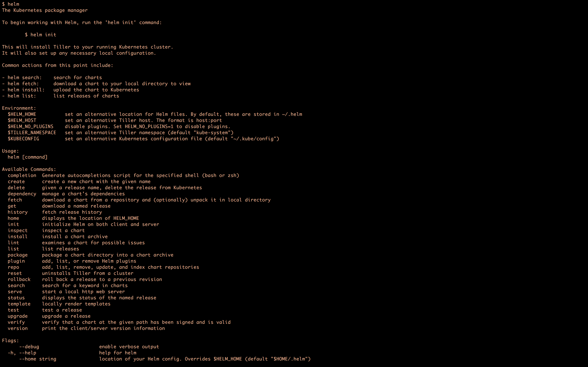
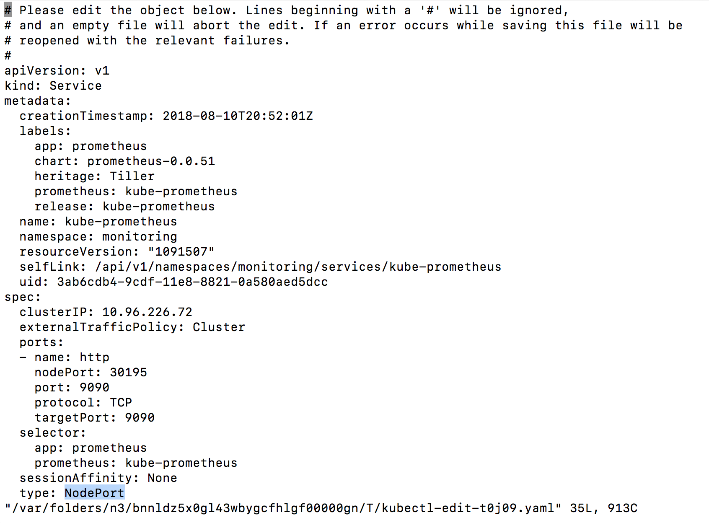
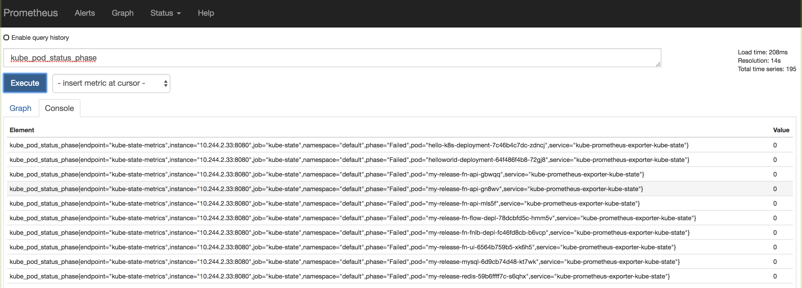
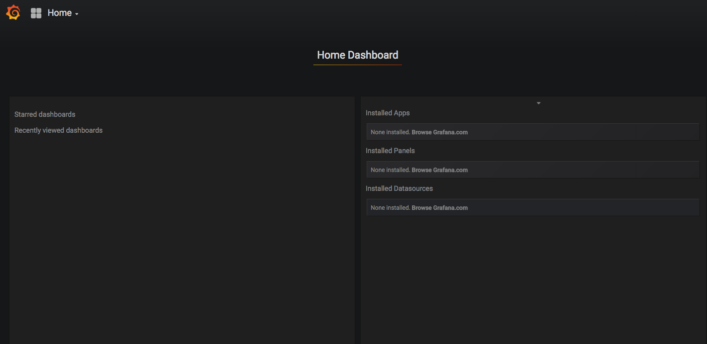
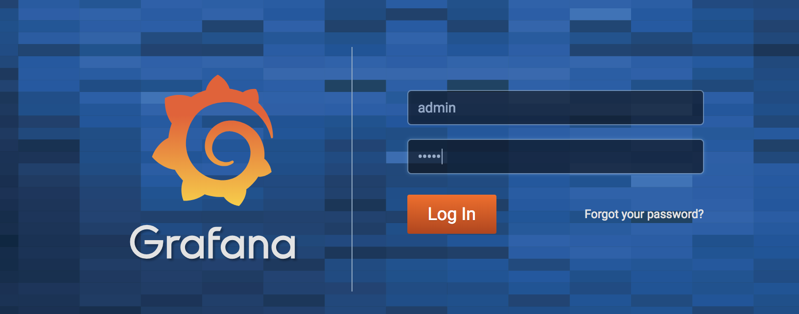

# Monitoring and Visualization with Prometheus and Grafana

## Getting Started with Helm and Prometheus

## Overview 

Application observability is critical throughout the lifecycle of a project. Monitoring and alerting through agent-based metrics collection has been the standard for enabling data insight for years, but how does this approach mesh with the dynamic nature of containers and schedulers? The agent-based approach would have to be re-imagined, metrics would have to be collected effortlessly from within the container, and, to allow for scalability, the solution would need to avoid requiring additional effort as new containers are spun up.

## Illuminating your environment with Prometheus

When it comes to open source cloud-native monitoring, Prometheus is widely considered to be the best place to start. Prometheus is a systems monitoring and alerting toolkit that Cloud Computing Native Foundation (CNCF) recommends for container-based infrastructure. It recently became the second project to graduate from the CNCF program. It boasts powerful tools to scrape data applications, a multidimensional data model, a flexible query language to create powerful visualizations, and a built-in alert manager. 

We will also be installing Grafana on our cluster to enhance the metrics gathered by Prometheus. Grafana is another OSS solution often paired with Prometheus and other monitoring tools to model they data collected into beautiful and useful dashboards. 

### Getting started 
For this solution we will use Prometheus and Grafana to monitor a containerized environment managed by Kubernetes. We will use Oracle Container Engine for Kubernetes (OKE) for our Kubernetes cluster. OKE a fully-managed, scalable, and highly available service that you can use to deploy your containerized applications to the cloud. To start an OKE cluster follow this [friendly guide](http://www.oracle.com/webfolder/technetwork/tutorials/obe/oci/oke-full/index.html).

We can get started with Helm as soon as our cluster is ready. You can find the proper binary to download and install Helm on your system in the [GitHub repository of the project](https://github.com/kubernetes/helm#install). After the download is complete, open a terminal window and type in `helm`. You should see an output similar to this:



If you've gotten this far, you're halfway there! Now we install the Prometheus operator to our cluster. To do this, we run the following:

```
helm repo add coreos https://s3-eu-west-1.amazonaws.com/coreos-charts/stable/
```

### Installing Tiller 

OKE can come preconfigured with Tiller, a component that sits on your Kubernetes cluster to help manage your Helm deployments. If you clicked the box that said "Tiller (Helm) Enabled" simply run to upgrade it to match the client.

```
helm init --upgrade
```

There is no need to worry if you chose not to check that box. If so, follow these steps to configure Tiller.

First, create a service account on our cluster that's configured with the proper permissions.

```
kubectl -n kube-system create sa tiller
```

Next, we create a cluster role binding for our service account, to give it the proper permissions to manage releases.

```
kubectl create clusterrolebinding tiller --clusterrole cluster-admin --serviceaccount=kube-system:tiller
```

Lastly, we configure Helm to use this Tiller by running:

```
helm init --service-account tiller
```

Now you should be ready to install the operator on your system in a separate namespace.

```
helm install --namespace monitoring coreos/prometheus-operator
```

### Installing Prometheus 

Next, let's install kube-prometheus which gives us some Kubernetes manifests for Grafana dashboards and Prometheus rules that allow us to operate Kubernetes, but first we will to download some values to use for our deployment:

```
wget https://raw.githubusercontent.com/oracle/cloudnative/master/observability-and-analysis/telemetry/getting-started-with-helm-and-prometheus/getting-started-with-helm-and-prometheus/values.yaml
```

And install it with the following command:

```
helm install coreos/kube-prometheus --name kube-prometheus --namespace monitoring --values values.yaml
```

You should be able to view all of your newly started pods by running:

```
kubectl get po --namespace monitoring
```

## The magic behind the charts

Let's take a look at what we deployed by reviewing our values.yaml file, which contains the default values for our chart. As an example of how this works, let's zoom in on a specific section describing our storage.

```yaml
...
prometheus:

  storageSpec:
    volumeClaimTemplate:
      spec:
        storageClassName: oci
        accessModes: ["ReadWriteOnce"]
        resources:
          requests:
            storage: 50Gi
```

This specifies the use of an OCI Block Volume. This allows for our metrics to persist in the event of a pod restart. If you find you need additional space, simply change the configuration.

The Prometheus endpoint is exposed by default as a ClusterIp, which means that it will not be reachable outside of the cluster. To make it reachable instead edit the service and replace 'ClusterIp' with 'NodePort':

```
kubectl edit svc kube-prometheus -n monitoring
``` 



Run the following command to discover the port used to access Prometheus:
```
kubectl get svc --all-namespaces
```
Run the following command to get the IP addresses of your nodes: 

```
kubectl get nodes
```
Add the port number to the IP address of your node to get access to the Prometheus portal. 


Try querying for basic pod information. For example, you can search 'kube_pod_status_phase'




The next thing it does is add custom dashboards to Grafana to make our cluster monitoring a little bit easier. We are going to once again leverage our Helm chart's values.yaml file to accomplish this. Let's edit the values `serverDashboardFiles` under the Grafana object in this file. The dashboards tend to be a bit long, so we'll go over this at a very high level.

In order to include alternative ways of looking at cluster health you can create a new file under the `serverDashboardFiles` that holds the dashboard information within it. If you want to add more, simply write a new file with a dashboard in it!

```
  serverDashboardFiles:
    kube-custom-dashboard.json: |-
      {
      "dashboard": {
        "timezone": "browser",
        "title": "Kubernetes Cluster (Prometheus)",
        "uid": "4XuMd2Iiz",
        "version": 1
        ...
      }
    }
```

If you have existing Grafana dashboards that you would like to define, use this script to transform them into a format that the watcher can understand.

```
# !/bin/bash
#
# 2. ./prepare_dashboard.sh new_dashboard_xxx
# - This will create new_dashboard_xxx-dashboard.json
#

DIR="$( cd "$( dirname "${BASH_SOURCE[0]}" )" && pwd )"

if [ "$#" -ne 1 ]; then
  echo "Usage: ./prepare_dashboard.sh <name_of_dashboard>"
  exit
fi

# Prepare json for Grafana Watcher
pbpaste | \
  jq '.id = null | del(.__requires) | del(.uid) | { dashboard: . , inputs: .__inputs, overwrite: true  }' | \
  jq '.inputs[0].value=.inputs[0].pluginId' | \
tee "$DIR/$1-dashboard.json"
```

Finally, we need to access Grafana to view our metrics. To accomplish this, change the Grafana service type to be `NodePort` as we did with Prometheus. People typically will use ingress or the "LoadBalancer" service type with Grafana because of how often the dashboards are viewed. 

Run the following command to discover the port used to access Grafana:
```
kubectl get svc --all-namespaces
```
Run the following command to get the IP addresses of your nodes: 

```
kubectl get nodes
```
Add the port number to the IP address of your node to get access to the Grafana portal. 

It should look something like this: 



If you are prompted for login information, use the default username (`admin`) and password (`admin`) specified in the Helm chart. 



Explore the [Grafana documentation](http://docs.grafana.org/) for information about how to create more advanced charts to take full advantage of the service. 


And with that you are done! Now that you have an OKE cluster running a highly available monitoring setup complete with Grafana and Prometheus you can spend more time writing your applications rather than instrumenting and maintaining monitoring infrastructure. Happy hacking!
